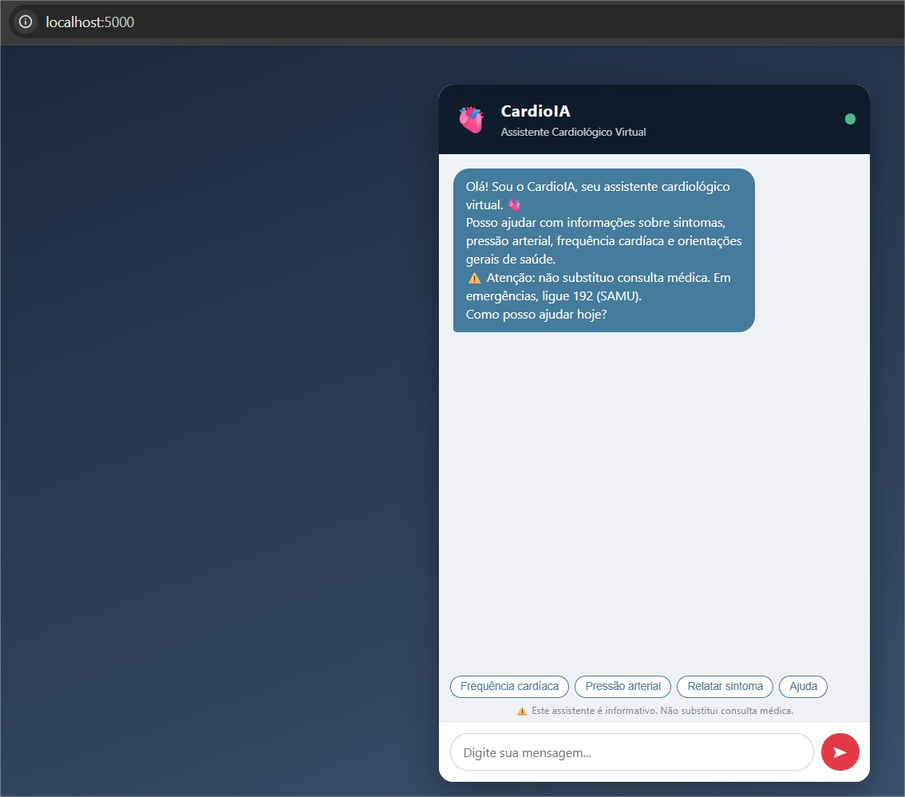
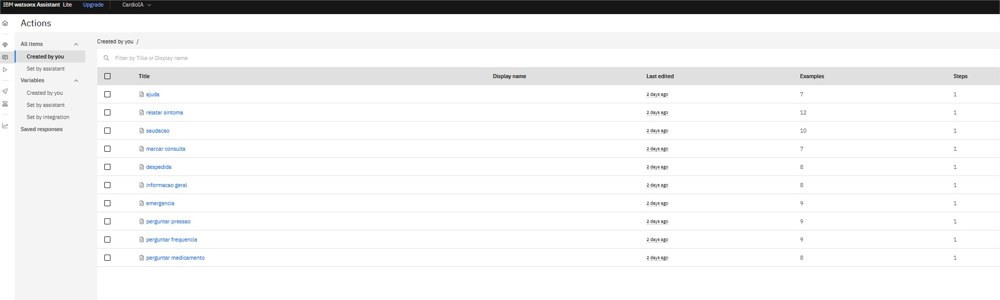
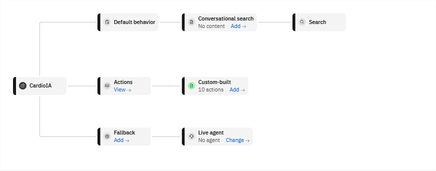

# FIAP - Faculdade de Informática e Administração Paulista

<p align="center">
<a href= "https://www.fiap.com.br/"></a>
</p>

<br>

# CardioIA – Fase 5, Capítulo 1
## Assistente Cardiológico Conversacional (Chatbot)

## Nome do grupo
CardioIA Team

## 👨‍🎓 Integrantes:
- <a href="https://www.linkedin.com/in/thiagoparaizo/?originalSubdomain=br">Thiago Paraizo da Silva</a>

## 👩‍🏫 Professores:
### Tutor(a)
-
### Coordenador(a)
- <a href="https://www.linkedin.com/company/inova-fusca">Andre Godoy Chiovato</a>

---

Este repositório contém o **CardioIA Chat**, um assistente cardiológico conversacional que
faz triagem inicial em linguagem natural. O fluxo de diálogo é modelado no **IBM Watson
Assistant** (intents, entities e dialog nodes), exposto por um **backend Flask** e consumido
por uma **interface web** de chat em HTML/CSS/JavaScript.

O assistente responde sobre sintomas cardiovasculares, pressão arterial, frequência cardíaca
e medicamentos, orienta sobre como buscar atendimento e — principalmente — **detecta
situações de emergência e responde com prioridade máxima**, exibindo os telefones de socorro.

---

## 1. Arquitetura

```
┌──────────────┐   HTTP/JSON   ┌──────────────────┐   SDK ibm-watson   ┌───────────────────┐
│   Usuário    │ ────────────► │  Flask (app.py)  │ ─────────────────► │  IBM Watson       │
│  (navegador) │               │                  │                    │  Assistant v2     │
│              │               │  /api/session    │ ◄───────────────── │  (NLP: intents,   │
│ index.html   │ ◄──────────── │  /api/message    │   intent + texto   │   entities,       │
│ chat.js      │   resposta +  │  /health         │                    │   dialog nodes)   │
│ style.css    │  is_emergency └──────────────────┘                    └───────────────────┘
└──────────────┘                        │
                                        │ fallback (seção 11 do plano)
                                        ▼
                               ┌──────────────────┐
                               │ mock_assistant.py│  assistente local por palavras-chave,
                               │                  │  usado se o Watson estiver indisponível
                               └──────────────────┘
```

O backend é quem guarda as credenciais e quem traduz a resposta do Watson para o contrato
consumido pelo frontend — incluindo o campo `is_emergency`, derivado do intent classificado,
que dispara o alerta visual na interface.

---

## 2. Estrutura do Repositório

```
fiap-ano2-fase5-cap1/
│
├── README.md                           ← Este arquivo
├── .gitignore
├── requirements.txt
│
├── docs/
│   └── screenshots/                    ← Evidências (Watson + interface)
│
├── parte1-watson-backend/
│   ├── app.py                          ← Backend Flask e rotas REST
│   ├── watson_config.py                ← Cliente Watson (credenciais via .env)
│   ├── mock_assistant.py               ← Fallback local sem nuvem
│   ├── watson_skill.json               ← Export do dialog skill (importável no Watson)
│   ├── .env.example                    ← Template de variáveis de ambiente
│   └── relatorio-parte1.md             ← Relatório da Parte 1
│
├── parte2-interface/
│   ├── templates/index.html            ← Interface de chat
│   ├── static/style.css
│   ├── static/chat.js
│   └── relatorio-parte2.md             ← Relatório da Parte 2
│
├── ir-alem-1-ia-generativa/             ← Extra: extração clínica com OpenAI
│   ├── extrator_clinico.ipynb
│   └── relatorio-ir-alem-1.md
|   └── relatorio-ir-alem-1.pdf
│
└── ir-alem-2-rpa-dados/                 ← Extra: RPA + SQLite + MongoDB
    ├── rpa_monitor.py
    ├── db_schema.sql
    ├── docker-compose.yml
    └── relatorio-ir-alem-2.md
```

---

## 3. Relatórios Técnicos

- 📄 **Parte 1 — Assistente Conversacional com NLP:** modelagem do Watson Assistant
  (intents, entities, dialog tree), integração Flask e considerações éticas no
  [Relatório da Parte 1](parte1-watson-backend/relatorio-parte1.md).
- 📄 **Parte 2 — Interface de Interação:** tecnologias, funcionalidades da interface e
  evidências no [Relatório da Parte 2](parte2-interface/relatorio-parte2.md).

---

## 4. Como Executar

### Passo 1 — Instalar as dependências

```bash
pip install -r requirements.txt
```

### Passo 2 — Configurar as credenciais

```bash
cd parte1-watson-backend
cp .env.example .env      # no Windows: copy .env.example .env
```

Preencha o `.env` com os dados da sua instância do Watson Assistant:

| Variável | Onde obter |
|---|---|
| `WATSON_API_KEY` | IBM Cloud → sua instância do Watson Assistant → *Service credentials* |
| `WATSON_SERVICE_URL` | Mesma tela das credenciais (ex.: `https://api.us-south.assistant.watson.cloud.ibm.com`) |
| `WATSON_ASSISTANT_ID` | Watson Assistant → *Assistant settings* → *Assistant IDs and API details* |

> **Sem credenciais?** Deixe `ASSISTANT_MODE=auto` (padrão): a aplicação sobe em modo
> **mock** e a interface funciona normalmente, com respostas locais por palavras-chave.
> Útil para avaliar a Parte 2 sem uma conta na IBM Cloud.

### Passo 3 — Subir a aplicação

```bash
python app.py
```

Acesse **http://localhost:5000**.

### Importar o fluxo no Watson Assistant

No **Watson Assistant clássico**: *Skills → Create skill → Dialog skill → Import skill* e
envie o arquivo [`parte1-watson-backend/watson_skill.json`](parte1-watson-backend/watson_skill.json).
Ele já contém os 11 intents (93 exemplos de treinamento), as 3 entities e os 19 dialog nodes.

Se a sua instância só oferece a experiência **watsonx Assistant (Actions)** — cenário mais
comum em contas novas da IBM Cloud —, use
[`parte1-watson-backend/watsonx_actions_import.csv`](parte1-watson-backend/watsonx_actions_import.csv)
(*Actions → ícone de Upload*) para criar as 10 actions com seus exemplos de frase, e depois
siga o [`watsonx-actions-guia.md`](parte1-watson-backend/watsonx-actions-guia.md) para
recriar a lógica de diálogo (prioridade de emergência, perguntas de acompanhamento por
sintoma) diretamente na interface, já que esse formato de importação não traz steps nem
condições — só o esqueleto de cada action.

---

## 5. Endpoints da API

| Método | Rota | Descrição | Payload |
|---|---|---|---|
| `GET` | `/` | Interface de chat | — |
| `POST` | `/api/session` | Cria a sessão do assistente | — |
| `POST` | `/api/message` | Envia mensagem e retorna resposta | `{ "session_id", "message" }` |
| `DELETE` / `POST` | `/api/delete-session` | Encerra a sessão | `{ "session_id" }` |
| `GET` | `/health` | Saúde do serviço e modo ativo | — |

Exemplo:

```bash
curl -s -X POST http://localhost:5000/api/session
# {"session_id":"...","mode":"mock"}

curl -s -X POST http://localhost:5000/api/message \
     -H "Content-Type: application/json" \
     -d '{"session_id":"...","message":"Estou tendo um infarto"}'
# {"response":"🚨 EMERGÊNCIA DETECTADA! ...","intent":"emergencia","is_emergency":true}
```

---

## 6. Fluxo Conversacional

11 intents, 3 entities e 19 dialog nodes, com **emergência avaliada antes de qualquer outro
assunto**:

| # | Nó | Condição |
|---|---|---|
| 1 | Boas-vindas | `welcome` |
| 2 | **Emergência** | `#emergencia` ← prioridade máxima |
| 3 | Saudação | `#saudacao` |
| 4 | Relatar Sintoma (+4 filhos) | `#relatar_sintoma` → `@sintoma` |
| 5 | Pressão Arterial (+3 filhos) | `#perguntar_pressao` → `@nivel_pressao` |
| 6 | Frequência Cardíaca | `#perguntar_frequencia` |
| 7 | Medicamentos | `#perguntar_medicamento` |
| 8 | Marcar Consulta | `#marcar_consulta` |
| 9 | Informação Geral | `#informacao_geral` |
| 10 | Ajuda | `#ajuda` |
| 11 | Despedida | `#despedida` |
| 12 | Fallback | `anything_else` |

Detalhamento completo no [Relatório da Parte 1](parte1-watson-backend/relatorio-parte1.md).

---

## 7. IR Além (extras)

### IR Além 1 — Extração clínica com IA Generativa

Notebook que usa a API da OpenAI (`gpt-4o-mini`) para transformar relatos clínicos em
texto livre em um JSON estruturado (sintomas, histórico, sinais vitais, nível de
urgência sugerido). Requer uma `OPENAI_API_KEY` própria — veja
[`extrator_clinico.ipynb`](ir-alem-1-ia-generativa/extrator_clinico.ipynb) e o
[Relatório do IR Além 1](ir-alem-1-ia-generativa/relatorio-ir-alem-1.md) (inclui como
executar e gerar o PDF).

### IR Além 2 — RPA + Dados Híbridos

Robô que simula leituras clínicas, detecta anomalias com **Isolation Forest** e grava
os alertas em **SQLite** (dado relacional) e **MongoDB** (dado semiestruturado, via
Docker). Testado de ponta a ponta, incluindo o fallback quando o MongoDB está fora do
ar.

```bash
cd ir-alem-2-rpa-dados
docker compose up -d      # sobe o MongoDB na porta 27018
python rpa_monitor.py      # seed + 3 ciclos de detecção
```

Detalhes em [`rpa_monitor.py`](ir-alem-2-rpa-dados/rpa_monitor.py) e no
[Relatório do IR Além 2](ir-alem-2-rpa-dados/relatorio-ir-alem-2.md).

---

## 8. Evidências

| Interface do chat | Alerta de emergência |
|---|---|
|  |  |

| Intents no Watson | Dialog tree no Watson |
|---|---|
|  |  |


---

## 9. Aviso Importante

⚠️ O CardioIA é um projeto **acadêmico e informativo**. Ele não realiza diagnóstico, não
prescreve medicamentos e **não substitui consulta médica**. Em caso de emergência, ligue
para o **SAMU (192)** ou os **Bombeiros (193)**.

---

## 10. Equipe
| Nome | RM | Turma |
|---|---|---|
| Thiago Paraizo da Silva | RM566159 | 2TIAOA-2026 |

## Licença

<p xmlns:cc="http://creativecommons.org/ns#" xmlns:dct="http://purl.org/dc/terms/"><a property="dct:title" rel="cc:attributionURL" href="https://github.com/agodoi/template">MODELO GIT FIAP</a> por <a rel="cc:attributionURL dct:creator" property="cc:attributionName" href="https://fiap.com.br">Fiap</a> está licenciado sobre <a href="http://creativecommons.org/licenses/by/4.0/?ref=chooser-v1" target="_blank" rel="license noopener noreferrer" style="display:inline-block;">Attribution 4.0 International</a>.</p>
