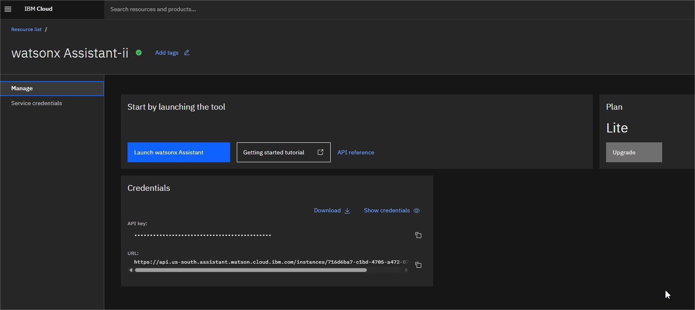
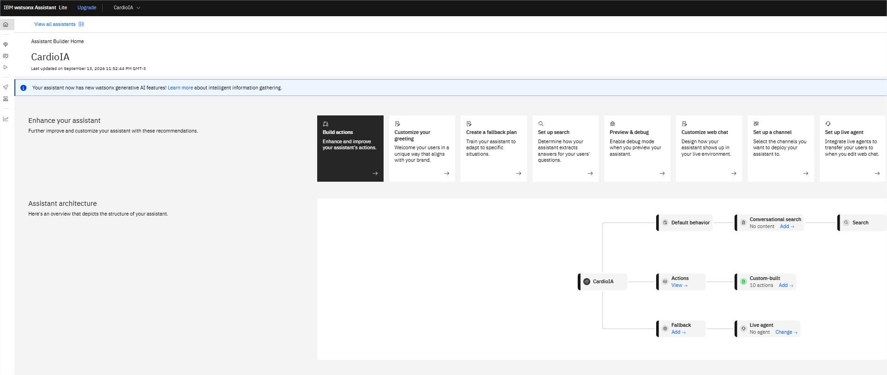

# Relatório – Parte 1: Assistente Conversacional com NLP

**Projeto:** CardioIA – Fase 5, Capítulo 1
**Aluno:** Thiago Paraizo da Silva – RM566159 | 2TIAOA-2026

---

## 1. Plataforma: IBM Watson Assistant

A modelagem do fluxo conversacional foi feita no **IBM Watson Assistant**, plataforma de
NLP apresentada na disciplina PCV, no plano **Lite** (gratuito, até 1.000 usuários ativos
por mês) da IBM Cloud.

| Item | Valor |
|---|---|
| Serviço | IBM Watson Assistant |
| Plano | Lite (gratuito) |
| Tipo de skill | Dialog skill |
| Versão da API | `v2` — `2023-06-15` |
| Idioma | Português (pt-BR) |
| SDK de integração | `ibm-watson==8.1.0` (Python) |

O Watson Assistant realiza três tarefas de NLP que sustentam o assistente:

1. **Classificação de intenções (intents)** — identifica *o que* o usuário quer, mesmo
   quando a frase não corresponde literalmente a nenhum exemplo de treinamento.
2. **Extração de entidades (entities)** — identifica *sobre o que* o usuário fala
   (qual sintoma, qual nível de pressão), permitindo respostas específicas.
3. **Gerenciamento de diálogo (dialog nodes)** — decide a resposta com base na
   combinação de intent, entities e contexto da conversa.

O recurso de **desambiguação** foi habilitado: quando duas intenções apresentam confiança
semelhante, o assistente pergunta ao usuário qual assunto ele deseja, em vez de arriscar
uma resposta errada — comportamento desejável em um domínio de saúde.

A modelagem completa está versionada em [`watson_skill.json`](watson_skill.json),
importável diretamente na interface do Watson Assistant
(*Skills → Create skill → Import skill*).

> **Nota sobre a plataforma:** ao criar a instância na IBM Cloud, só ficou disponível a
> experiência mais nova **watsonx Assistant (Actions)**, que substitui skills/dialog
> nodes por *actions*. Ela não importa `watson_skill.json` diretamente. Para essa
> instância, foi gerado um CSV de bootstrap
> ([`watsonx_actions_import.csv`](watsonx_actions_import.csv)) e um guia de como recriar
> a lógica de diálogo (prioridade de emergência, perguntas de acompanhamento por
> sintoma) na interface de Actions — ver
> [`watsonx-actions-guia.md`](watsonx-actions-guia.md). O `watson_skill.json` permanece
> como a documentação de referência do fluxo conversacional completo pedido no plano.

---

## 2. Fluxo Conversacional

O assistente foi modelado com **11 intents**, **3 entities** e **19 dialog nodes**
(12 nós principais + 7 nós filhos de refinamento), cobrindo:

- Triagem inicial de sintomas cardíacos
- Orientações sobre pressão arterial e frequência cardíaca
- Detecção de emergências, com resposta prioritária e contatos de socorro
- Informações gerais sobre medicamentos (sempre sem prescrever)
- Indicação de como e onde buscar atendimento médico
- Fallback para entradas não reconhecidas

### 2.1 Intents

| Intent | Função | Nº de exemplos |
|---|---|---|
| `saudacao` | Abertura da conversa | 10 |
| `despedida` | Encerramento | 8 |
| `relatar_sintoma` | Relato de sintomas cardiovasculares | 12 |
| `perguntar_pressao` | Dúvidas sobre pressão arterial | 9 |
| `perguntar_frequencia` | Dúvidas sobre frequência cardíaca | 9 |
| `perguntar_medicamento` | Dúvidas sobre medicações cardíacas | 8 |
| `marcar_consulta` | Agendamento de atendimento | 7 |
| `emergencia` | Situação de risco de vida | 9 |
| `ajuda` | Descoberta das funcionalidades | 8 |
| `informacao_geral` | Educação sobre doenças cardiovasculares | 8 |
| `nao_entendeu` | Entradas sem sentido no domínio | 5 |
| **Total** | | **93 exemplos** |

### 2.2 Entities

| Entity | Valores | Finalidade |
|---|---|---|
| `@sintoma` | `dor_no_peito`, `palpitacao`, `falta_de_ar`, `tontura`, `fadiga` | Direcionar a resposta ao sintoma específico relatado |
| `@nivel_pressao` | `normal`, `alta`, `baixa` | Diferenciar orientação de hipertensão × hipotensão |
| `@valor_bpm` | mapeada para a system entity `sys-number` | Capturar valores numéricos (BPM, pressão) informados pelo usuário |

Todas as entities usam *fuzzy matching*, o que tolera variações de grafia e acentuação
comuns em digitação rápida no celular.

### 2.3 Estrutura de nós de diálogo

Os nós são avaliados de cima para baixo. A ordem foi definida intencionalmente para que
**emergência seja sempre verificada antes de qualquer outro assunto**:

```
1.  Boas-vindas ................... welcome
2.  Emergência .................... #emergencia          ← prioridade máxima
3.  Saudação ...................... #saudacao
4.  Relatar Sintoma ............... #relatar_sintoma
      4.1 Dor no peito ............ @sintoma:dor_no_peito
      4.2 Palpitação .............. @sintoma:palpitacao
      4.3 Falta de ar ............. @sintoma:falta_de_ar
      4.4 Orientação geral ........ true (default)
5.  Pressão Arterial ............. #perguntar_pressao
      5.1 Pressão alta ............ @nivel_pressao:alta
      5.2 Pressão baixa ........... @nivel_pressao:baixa
      5.3 Valores de referência ... true (default)
6.  Frequência Cardíaca .......... #perguntar_frequencia
7.  Medicamentos ................. #perguntar_medicamento
8.  Marcar Consulta .............. #marcar_consulta
9.  Informação Geral ............. #informacao_geral
10. Ajuda ........................ #ajuda
11. Despedida .................... #despedida
12. Fallback ..................... anything_else
```

Os nós 4 e 5 usam `next_step: skip_user_input`, de modo que, ao reconhecer a intenção, o
Watson avalia imediatamente os filhos e responde de forma específica à entidade detectada
na mesma mensagem — sem exigir uma segunda rodada de perguntas.

---

## 3. Diagrama do Fluxo


### 3.1 IBM Cloud 


---


## 4. Integração Backend (Flask)

A aplicação Flask ([`app.py`](app.py)) é a camada intermediária entre a interface web e o
Watson Assistant. Ela mantém as credenciais fora do navegador, normaliza a resposta do
Watson e enriquece o retorno com a sinalização de emergência consumida pelo frontend.

### 4.1 Endpoints

| Método | Rota | Descrição |
|---|---|---|
| `GET` | `/` | Serve a interface de chat (Parte 2) |
| `POST` | `/api/session` | Cria uma sessão no Watson Assistant e devolve o `session_id` |
| `POST` | `/api/message` | Envia a mensagem do usuário e devolve a resposta do assistente |
| `DELETE` / `POST` | `/api/delete-session` | Encerra a sessão (POST aceito para `navigator.sendBeacon`) |
| `GET` | `/health` | Verificação de saúde e modo de operação ativo |

### 4.2 Contrato de `/api/message`

```jsonc
// Requisição
{ "session_id": "e8f2...", "message": "Estou sentindo dor no peito" }

// Resposta
{
  "response": "Dor no peito é um sintoma que merece atenção imediata. ⚠️ ...",
  "intent": "relatar_sintoma",
  "is_emergency": false,
  "mode": "watson"
}
```

O campo `is_emergency` é derivado do intent de maior confiança retornado pelo Watson
(`intents[0].intent == "emergencia"`). É ele que dispara o banner vermelho na interface —
ou seja, a classificação de NLP feita pelo Watson controla diretamente o comportamento
visual do sistema.

### 4.3 Organização do código

- [`watson_config.py`](watson_config.py) — fábrica do cliente `AssistantV2` e validação das
  credenciais. Nenhum segredo fica no código: tudo vem do `.env` (versionado apenas como
  [`.env.example`](.env.example), com o `.env` real no `.gitignore`).
- [`mock_assistant.py`](mock_assistant.py) — assistente local por palavras-chave, usado
  como **fallback técnico** quando o Watson está indisponível.
- [`app.py`](app.py) — rotas REST e seleção do backend conversacional.

### 4.4 Modo de operação e fallback

A variável `ASSISTANT_MODE` no `.env` controla qual backend conversacional é usado:

| Valor | Comportamento |
|---|---|
| `auto` (padrão) | Usa o Watson se houver credenciais válidas; caso contrário, cai para o mock |
| `watson` | Força o uso do Watson Assistant |
| `mock` | Força o assistente mock local |

O mock existe para que a demonstração da interface não fique bloqueada por indisponibilidade
da nuvem (quota do plano Lite excedida ou instabilidade). Ele reproduz, por palavras-chave,
as mesmas respostas dos nós de diálogo, **mas não realiza NLP**: a modelagem real do
assistente é a que está em `watson_skill.json`. O endpoint `/health` informa qual modo está
ativo, e a interface indica isso no *tooltip* do indicador de status.

---

## 5. Considerações Éticas

Um assistente que conversa sobre saúde exige cuidados que vão além do acerto técnico. As
decisões tomadas foram:

1. **Aviso permanente de não substituição médica** — presente na mensagem de boas-vindas,
   fixo na interface e repetido nas respostas sensíveis.
2. **Emergência com prioridade máxima** — o nó de emergência é o primeiro avaliado no
   dialog tree, antes de qualquer outro assunto, e responde com os telefones do SAMU (192)
   e dos Bombeiros (193) em vez de tentar triagem adicional.
3. **Nunca prescrever** — o nó de medicamentos explica *classes* terapêuticas e reforça que
   qualquer medicação depende de prescrição; o assistente também orienta explicitamente a
   nunca interromper medicação por conta própria.
4. **Sem diagnóstico** — as respostas descrevem sinais de alerta e indicam quando procurar
   atendimento, sem afirmar o que o usuário tem.
5. **Privacidade** — nenhuma conversa é persistida pela aplicação; o `user_id` enviado ao
   Watson é um UUID aleatório por requisição, sem dado pessoal identificável.
6. **Transparência sobre limitações** — o fallback deixa claro o escopo do assistente em
   vez de improvisar respostas fora do domínio, e a interface sinaliza quando está rodando
   em modo mock.

---

## 6. Trabalho em Equipe

Entrega realizada individualmente. O critério de ponto extra por trabalho em grupo não se
aplica a esta submissão.
